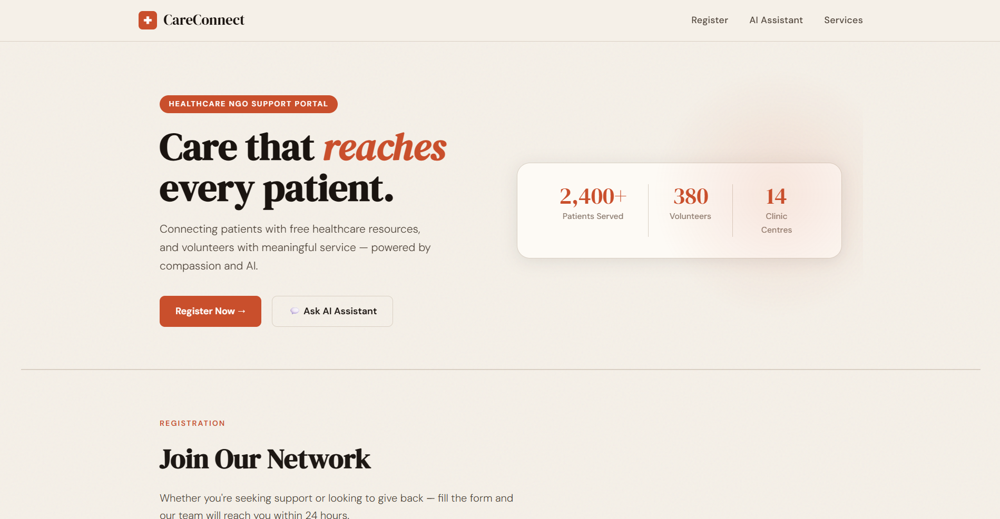
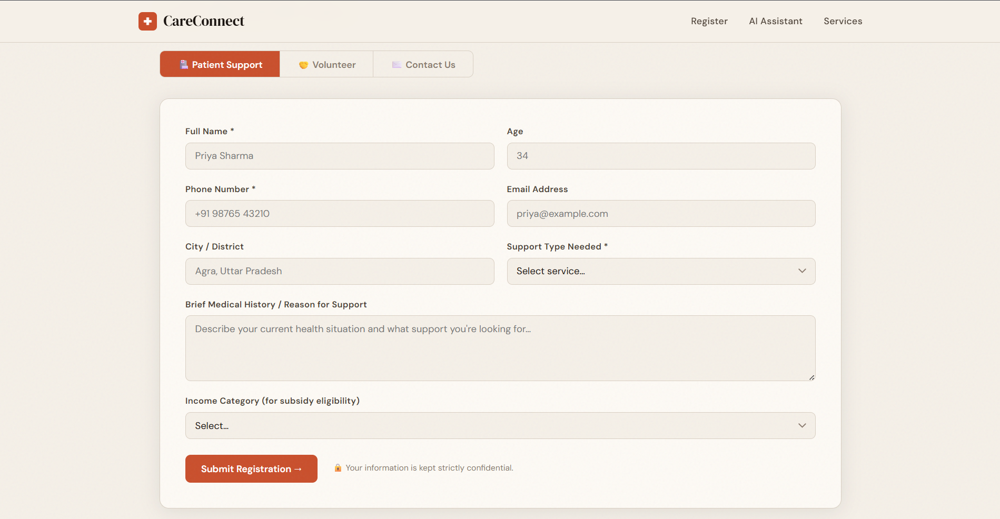
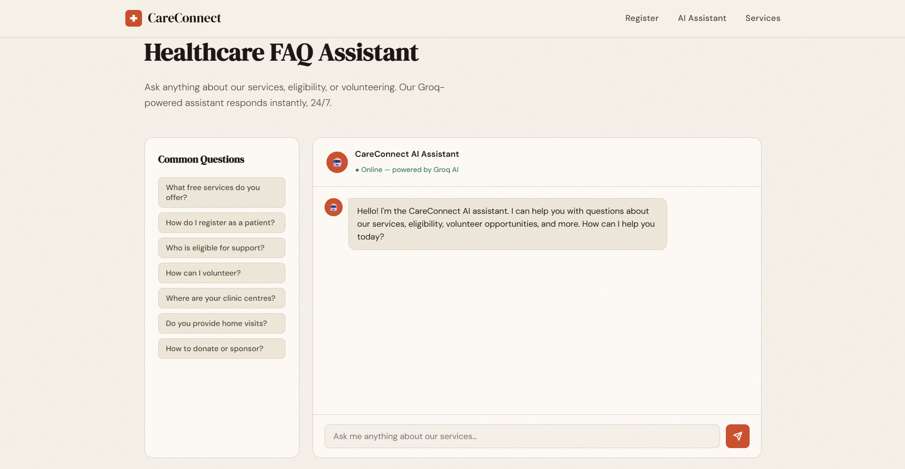

# Internship Assignment Submission

**Candidate Name:** Harshit Trivedi 
**Project:** CareConnect  
**NGO Use Case:** Jarurat Care NGO  

---

## 🔗 Project Links

*   **Live Hosted App:** [**https://careconnect-7xnt.onrender.com**](https://careconnect-7xnt.onrender.com)
*   **GitHub Repository:** [**https://github.com/AquillaRival/CareConnect**](https://github.com/AquillaRival/CareConnect)

> ⚠️ *Note: The app is hosted on Render's free tier. If the link takes ~30 seconds to load on the first click, it is because free instances sleep after inactivity to conserve resources.*

---

## 🛠️ Tech Stack Used

| Layer | Technologies |
| :--- | :--- |
| **Backend Framework:** | Node.js, Express.js |
| **Database:** | MongoDB Atlas |
| **Frontend/Templating:** | EJS (Embedded JavaScript), Vanilla HTML/CSS/JS |
| **AI Integration:** | Groq API (Model: `llama-3.3-70b-versatile`) |
| **Hosting:** | Render (Web Service) |
| **Source Control:** | Git, GitHub |

---

## 🤖 The AI Ideas (Two Features)

This platform goes beyond a simple form by integrating **two intelligent AI features** using Groq's high-speed inference API (Llama 3.3).

### 1. The 24/7 Healthcare FAQ Chatbot
A live chat assistant is embedded on the homepage. 
*   **The Problem:** NGO staff spend hours answering the same questions about eligibility for free healthcare, subsidised medicines, or clinic locations.
*   **The Solution:** The AI acts as a dedicated Jarurat Care representative, answering patient queries instantly. It maintains **multi-turn conversation history**, so follow-up questions process context correctly.

### 2. The Volunteer Deployment Matcher
*   **The Problem:** When volunteers sign up, coordinators struggle to figure out how best to use their unstructured skills. 
*   **The Solution:** When a volunteer registers (e.g., as an Admin with "experience scheduling events"), the Groq AI intercepts the submission, analyses the data, and returns a tailored 2-sentence deployment suggestion describing precisely how **Jarurat Care** will utilise their skills. 

---

## 🏥 Jarurat Care NGO — The Core Use Case

The target use-case for this portal is to support **Jarurat Care** — an NGO providing free and subsidised healthcare, diagnostic tests, and mental health support to underserved communities via 14 clinic centres.

The application contains **three secure form flows** bound to a MongoDB Atlas backend:
1.  **Patient Support Request:** Low-income/BPL patients can request medical consultations, maternal care, or home visits.
2.  **Volunteer Application:** For medical professionals, admin staff, and drivers to offer their services. 
3.  **General Contact Enquiries:** For partnerships and donations.

---

## 📸 Screenshots

### 1. The Landing Page & Premium UI

### 2. Patient / Volunteer Registration Forms

### 3. AI Chatbot

 

<i>Prepared for Internshala Assignment • March 2026</i>

